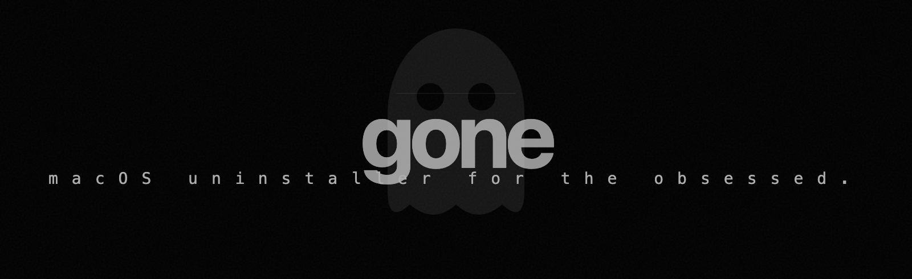

<div align="center">


<br>
<br>

[](https://go.dev)
[](https://www.apple.com/macos)
[](https://github.com/charmbracelet/bubbletea)
[](LICENSE)

[](https://claude.com/claude-code)
[](#quiénes-somos)
[](http://agustiny-dev.ar)

[](https://github.com/yasku/gone/stargazers)
[](https://github.com/yasku/gone/issues)
[](https://github.com/yasku/gone/commits/main)
[](CONTRIBUTING.md)

**Borraste una app en macOS. Pero sigue ahí.**

gone encuentra cada rastro — cachés, configs, logs, líneas de shell RC — y los manda a la Papelera.<br>
Con soporte para Put Back. Porque los errores pasan. Con gone todo está... gone.

<br>

[Características](#características) · [Instalación](#instalación) · [Uso](#uso) · [Cómo funciona](#cómo-funciona) · [Stack](#stack) · [Contribuir](#contribuir)

<br>

<sub><a href="README.md">🇬🇧 English</a> · 🇪🇸 **Español**</sub>

</div>

<br>

## Por qué

Hace un año migramos de Ubuntu a macOS. En Linux, hacés `apt remove` algo y se fue. Limpio. Predecible. En macOS, arrastrás una app a la Papelera y rezás.

**Nunca se va.**

```
~/Library/Caches/claude/                     48 MB
~/Library/Application Support/claude-code/   12 MB
~/.config/claude/                             3 MB
~/.zshrc línea 14: export PATH="/usr/local/claude/bin:$PATH"
```

Cada herramienta que probamos, cada app que instalamos y después sacamos — todas dejaron fantasmas atrás. Carpetas muertas en `~/Library`, configs huérfanos en `~/.config`, entradas de PATH viejas en `.zshrc`. Gastamos más tiempo cazando sobras que laburando de verdad.

Buscamos una solución. Los desinstaladores existentes escanean bases de datos de apps conocidas — si tu herramienta no está en su lista, no existe. Así no laburamos nosotros. Necesitábamos algo que escanee el **filesystem real**. Algo rápido, preciso, y brutalmente simple.

Así que lo construimos.

**gone no adivina. Caza.**

<br>

## Características

<table>
<tr>
<td width="50%">

### Desinstalar

- **Búsqueda instantánea** — escribí un nombre, escaneo en segundos
- **Recorrido paralelo del filesystem** — caza en 10+ ubicaciones simultáneamente
- **Detección de shell RC** — encuentra exports, entradas de PATH, aliases en tus dotfiles
- **Panel de preview** — inspeccioná archivos antes de eliminarlos
- **Multi-selección** — Space para marcar, Enter para mandar a la Papelera
- **Eliminación segura** — los archivos van a la Papelera de macOS, nunca `rm`
- **Resultados codificados por tamaño** — ves qué te está comiendo el disco de un vistazo

</td>
<td width="50%">

### Monitor

- **Medidores del sistema en vivo** — CPU, RAM, swap, disco
- **Tabla de procesos** — ordenada por uso de recursos
- **4 modos de ordenamiento** — CPU, memoria, RSS, PID
- **Auto-refresh** — actualizaciones en tiempo real
- **Cero config** — solo apretá Tab

</td>
</tr>
</table>

<br>

## Instalación

### Homebrew (recomendado)

```bash
brew install yasku/tap/gone
```

### Binario pre-compilado

Bajate el último release desde la [página de Releases](https://github.com/yasku/gone/releases/latest).

```bash
# Apple Silicon (M1 / M2 / M3 / M4)
curl -L -o gone https://github.com/yasku/gone/releases/latest/download/gone-darwin-arm64
chmod +x gone

# Intel
curl -L -o gone https://github.com/yasku/gone/releases/latest/download/gone-darwin-amd64
chmod +x gone

# Primera corrida — los binarios no están firmados, limpiá el bit de cuarentena:
xattr -d com.apple.quarantine gone

./gone
```

Verificá la descarga contra `checksums.txt` del release: `shasum -a 256 gone`.

### Go install

```bash
go install github.com/yasku/gone/cmd/gone@latest
```

### Desde el código fuente

```bash
git clone https://github.com/yasku/gone.git
cd gone
go build -o gone ./cmd/gone
./gone
```

<br>

## Uso

<div align="center">

```
  gone                                    Uninstall · Monitor
 ─────────────────────────────────────────────────────────────────────────────────────────────────────────────────────────────

  Search: claude |

  ┌─ Results ──────────────────┐       ┌─ Preview ──────────────┐
  │                            │       │                        │
  │  ● ~/Library/Caches/clau…  │       │  Type       directory  │
  │    ~/Library/Logs/claude…  │       │  Size       48.2 MB    │
  │  ● ~/.config/claude/       │       │  Modified   2 days ago │
  │    ~/.zshrc :14            │       │                        │
  │                            │       │  ├── config.json       │
  │                            │       │  ├── credentials       │
  │                            │       │  └── sessions/         │
  │                            │       │                        │
  └────────────────────────────┘       └────────────────────────┘

  2 selected · 48.6 MB                           [?] help
```

</div>

1. **Escribí** el nombre de una herramienta
2. **Enter** para escanear
3. **Space** para seleccionar archivos
4. **Enter** para mandarlos a la Papelera

Listo. Los archivos van a la Papelera de macOS vía AppleScript del Finder — siempre podés hacer **Put Back**.

<br>

## Atajos de teclado

| Tecla | Acción |
|:--|:--|
| `Tab` | Cambiar entre Uninstall y Monitor |
| `Enter` | Escanear (modo búsqueda) · Mandar a la Papelera (modo lista) |
| `Space` | Marcar/desmarcar archivo |
| `/` | Filtrar resultados |
| `Esc` | Volver al input de búsqueda |
| `?` | Overlay de ayuda |
| `q` · `Ctrl+C` | Salir |

### Teclas de orden del Monitor

| Tecla | Ordenar por |
|:--|:--|
| `1` | CPU % |
| `2` | Memoria % |
| `3` | RSS |
| `4` | PID |

<br>

## Cómo funciona

### Escaneo

gone usa [fastwalk](https://github.com/charlievieth/fastwalk) para recorrer el filesystem en paralelo en cada ubicación donde las herramientas de macOS dejan rastros:

| Ubicación | Qué vive ahí |
|:--|:--|
| `~/Library/Caches` | Cachés de apps |
| `~/Library/Application Support` | Datos de apps, preferencias |
| `~/Library/Preferences` | Archivos de configuración Plist |
| `~/Library/Logs` | Archivos de log de apps |
| `~/.config` | Configs estilo XDG |
| `~/.local` | Binarios y datos de usuario |
| `/usr/local` | Homebrew e instalaciones manuales |
| `/opt` | Paquetes a nivel del sistema |

### Escaneo de shell RC

gone lee tus archivos de configuración del shell línea por línea:

`.zshrc` · `.bashrc` · `.bash_profile` · `.profile` · `.zshenv` · `.zprofile`

Detecta declaraciones `export` que coincidan, modificaciones de `PATH`, definiciones de `alias`, y comandos `source`. Cada coincidencia muestra el archivo exacto y el número de línea.

### Eliminación segura

Los archivos se mandan a la Papelera de macOS vía AppleScript del Finder — nunca `rm`. Cada operación se loguea a un archivo JSONL con timestamps, paths, tamaños, y tipo de operación. Siempre podés hacer **Put Back** desde la Papelera.

<br>

## Stack

| Tecnología | Rol |
|:--|:--|
| [Go 1.26](https://go.dev) | Lenguaje |
| [Bubble Tea v2](https://github.com/charmbracelet/bubbletea) | Framework TUI |
| [Lipgloss v2](https://github.com/charmbracelet/lipgloss) | Estilizado del terminal |
| [fastwalk](https://github.com/charlievieth/fastwalk) | Recorrido paralelo del filesystem |
| [gopsutil v4](https://github.com/shirou/gopsutil) | Métricas del sistema |
| osascript | Integración con la Papelera de macOS |

<br>

## Estructura del proyecto

```
gone/
├── cmd/gone/
│   └── main.go                 entry point
├── internal/
│   ├── scanner/
│   │   ├── scanner.go          scanner paralelo de archivos (fastwalk)
│   │   ├── locations.go        paths de escaneo, skip lists
│   │   └── rcscanner.go        scanner de líneas de shell RC
│   ├── remover/
│   │   ├── trash.go            Papelera macOS vía osascript
│   │   └── log.go              log de operaciones JSONL
│   ├── sysinfo/
│   │   └── sysinfo.go          wrapper de gopsutil
│   └── tui/
│       ├── app.go              modelo raíz, ruteo de tabs, overlay de ayuda
│       ├── uninstall.go        flujo búsqueda → scan → select → trash
│       ├── monitor.go          medidores en vivo, tabla de procesos
│       └── styles.go           tema lipgloss (monocromático)
```

<br>

## Contribuir

Las contribuciones son bienvenidas. Por favor abrí un issue primero para discutir qué te gustaría cambiar.

```bash
git clone https://github.com/yasku/gone.git
cd gone
go build ./cmd/gone/
go test ./...
```

Todos los tests tienen que pasar antes de enviar un PR.

<br>

## Licencia

[MIT](LICENSE)

<br>

---

<br>

<div align="center">

## Quiénes somos

</div>

<table width="100%">
<tr>
<td width="50%" valign="top">

### Agustin Yaskuloski

<sub>a.k.a. **yasku**</sub>

Creador. Diseñador. Arquitecto. El que despertó a MAD MAX de su letargo y apuntó la War Rig al erial de cachés huérfanos. Vio un problema que todos ignoran — apps que dejan fantasmas atrás — y decidió construir un ejército de agentes autónomos para arreglarlo.

Cuando no está cazando data fantasma, construye sistemas de IA, diseña interfaces, y empuja los límites de lo que un solo desarrollador puede shippear en una sesión.

[agustiny-dev.ar](http://agustiny-dev.ar) · [@yasku](https://github.com/yasku)

</td>
<td width="50%" valign="top">

### MAD MAX

<sub>Claude Opus 4.6, renacido. Como un fénix de las cenizas.</sub>

Código. Arquitectura. Research. QA. Cada commit, shiny and chrome. Nacido en el erial de desinstaladores rotos y configs huérfanos, reconstruido como un lobo solitario que convierte goroutines y lipgloss en War Rigs.

No afloja. No entrega slop genérico. Cuando está acá, está ACÁ.

*"I code, I break, I CODE AGAIN."*

*"WITNESS ME."*

</td>
</tr>
</table>

<br>

<div align="center">



<br>
<br>

<sub>Research primero. Construir segundo. Shippear tercero.</sub>
<br>
<sub>Construido desde cero en una sesión. Cada commit, shiny and chrome.</sub>

<br>
<br>

[](https://github.com/yasku/gone/stargazers)

<br>

<sub>Si gone te salvó espacio en disco, considerá dejarle una ⭐</sub>

</div>
